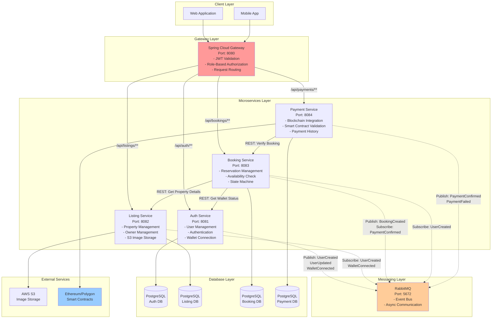
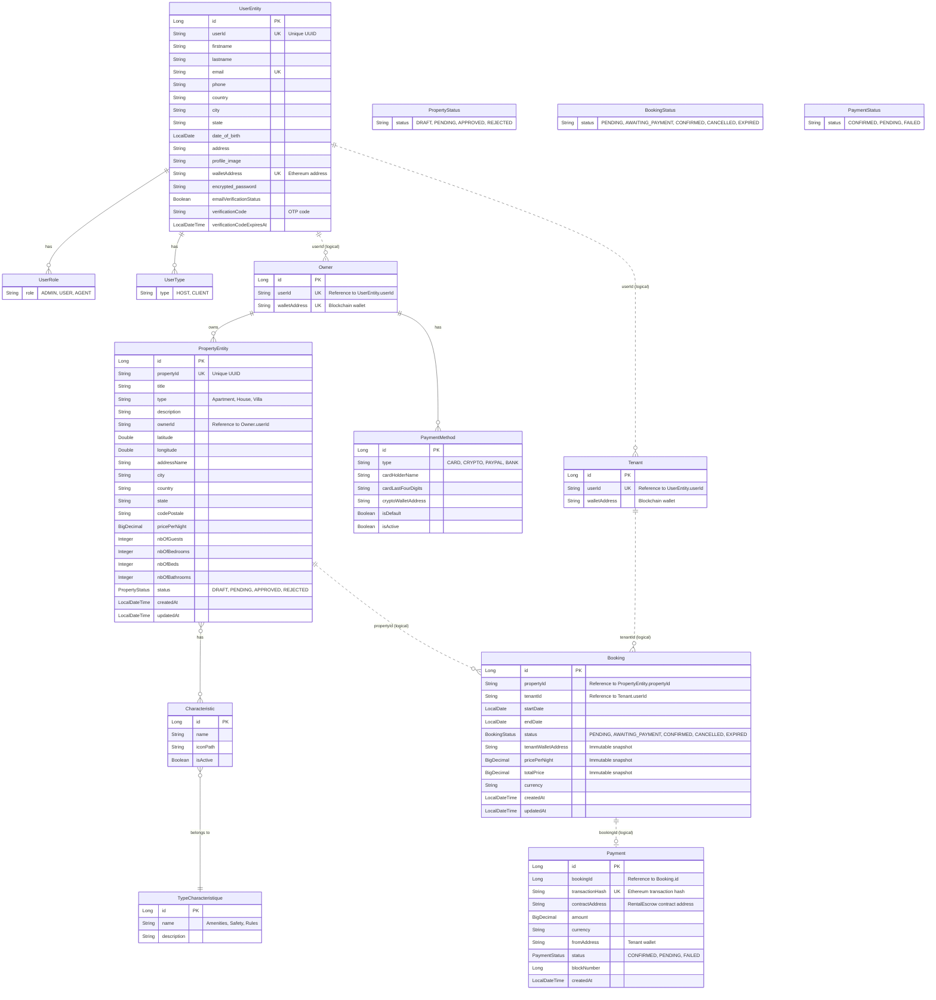
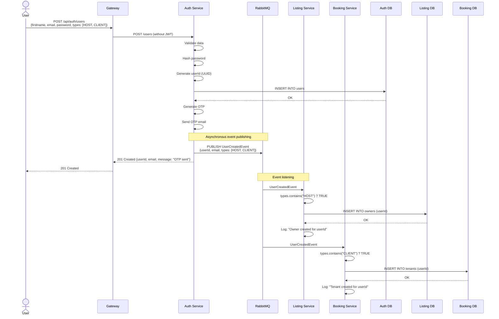
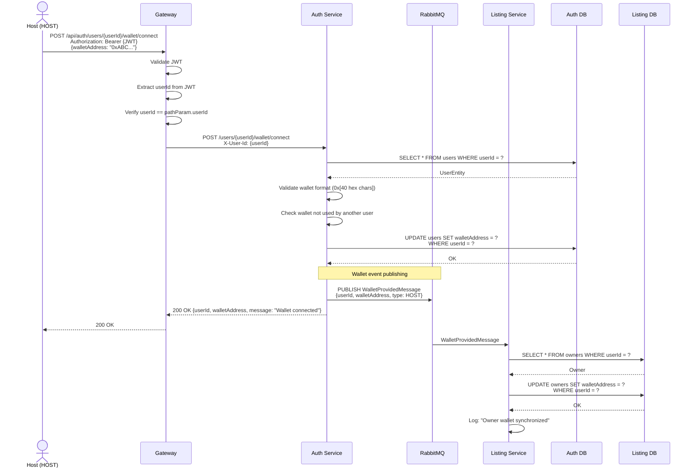
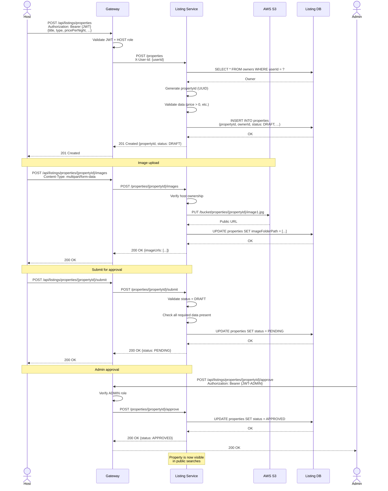
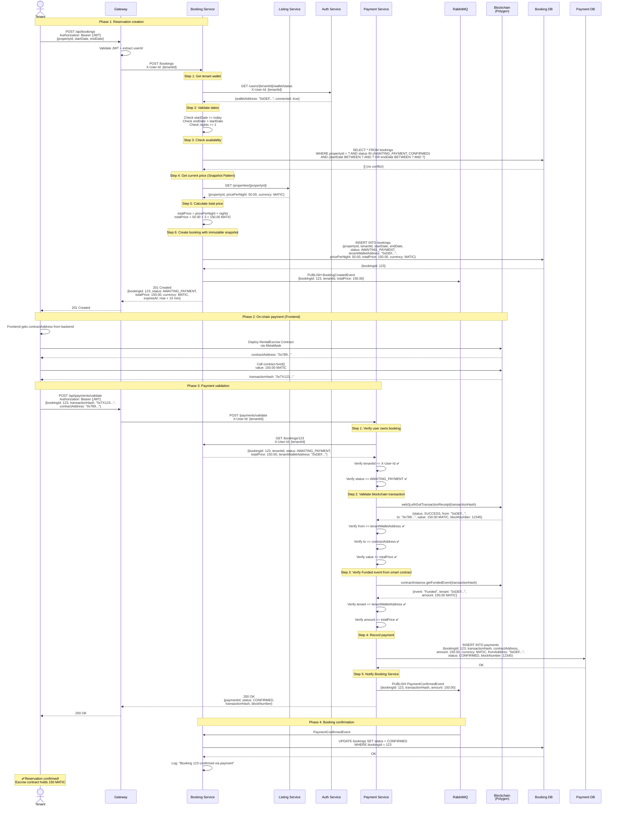
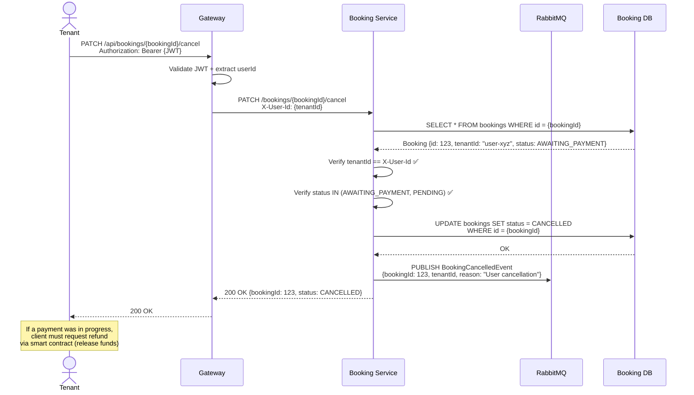
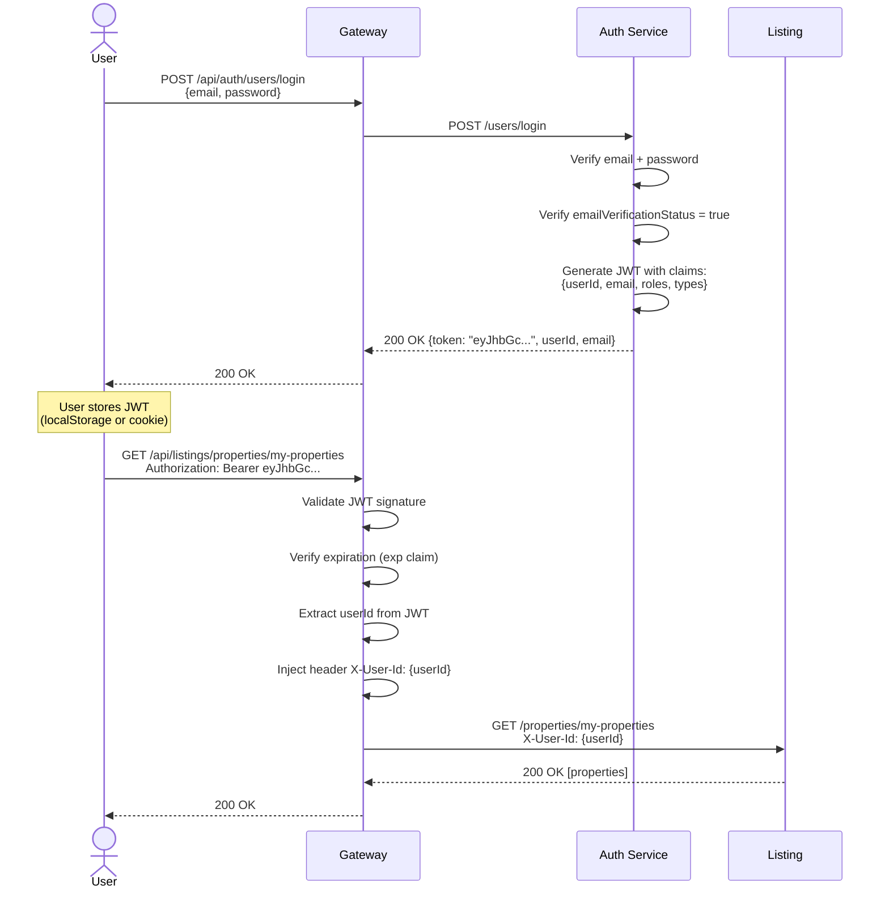
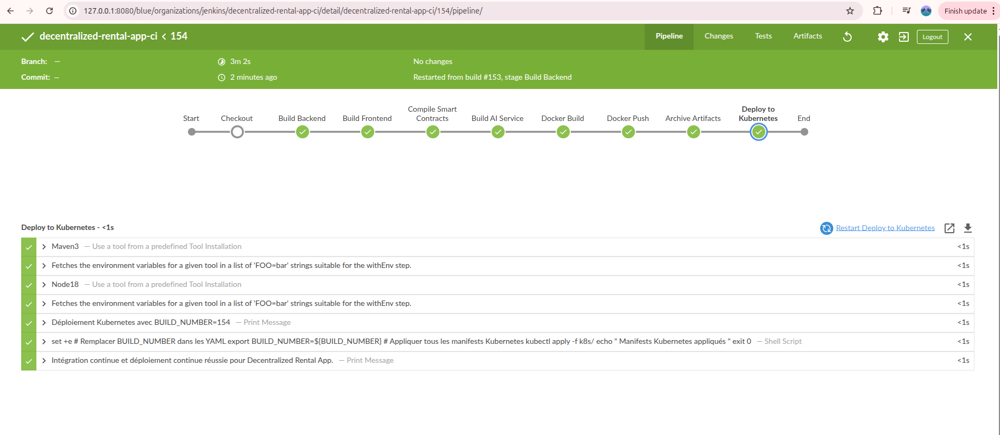
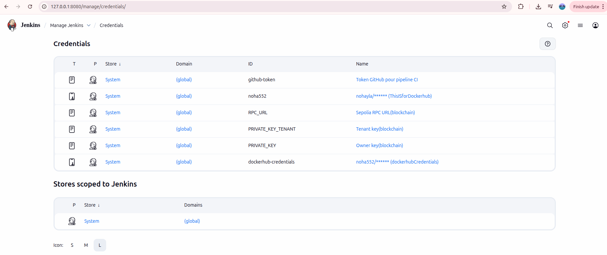

# Decentralized Microservices Application for Real Estate Rental on Ethereum Blockchain

## Project Description

This project implements a **Decentralized Real Estate Rental Platform** based on a **microservices architecture** and **Ethereum blockchain** technology.

The platform enables secure, transparent, and peer-to-peer rental transactions without traditional intermediaries. Rental payments and lease execution are enforced by smart contracts deployed on Ethereum, while backend microservices and a modern frontend provide usability, scalability, and extensibility.

---

## Table of Contents

- [Project Objectives](#project-objectives)
- [Technologies Used](#technologies-used)
- [Microservices Architecture](#microservices-architecture)
- [Blockchain & Payment Module](#blockchain--payment-module)
- [Backend Development](#backend-development)
- [Frontend Development](#frontend-development)
- [DevOps](#devops)
- [Cloud Infrastructure](#cloud-infrastructure)
- [ML & FastAPI](#ml--fastapi)
- [Team Roles And Responsibilities](#team-roles--responsibilities)


---

## Project Objectives

- Enable peer-to-peer property listing and rental using smart contracts to ensure trust, security, and automation
- Build a scalable microservices-based backend using Spring Boot, integrated with blockchain and data services
- Develop a modern frontend with React for seamless user interaction between tenants and property owners
- Integrate AI-driven analytics and machine learning models to provide dynamic rental price suggestions, tenant risk scoring, personalized property recommendations, and market trend predictions
- Apply DevOps and cloud-native practices (Docker, Kubernetes, CI/CD, Terraform on AWS) to ensure scalability, reliability, and continuous deployment
- Demonstrate effective collaboration between multiple engineering roles and modern full-stack, blockchain, AI, and DevOps technologies

---

## Technologies Used

### Backend
- **Spring Boot** (Microservices)
- **Java 17**
- **Web3j** (Blockchain integration)
- **PostgreSQL**
- **RabbitMQ**

### Frontend
- **React**

### Blockchain
- **Ethereum** (Sepolia Testnet)
- **Solidity** Smart Contracts
- **Hardhat**
- **MetaMask**

### DevOps & Cloud
- **Docker** & Docker Compose
- **Kubernetes** (planned)
- **CI/CD** (GitHub, Jenkins – planned)
- **Monitoring** (Prometheus & Grafana – planned)

### AI & Data
- **Python**
- **FastAPI** (microservice)
- **Scikit-learn**
- **Pandas**, **Plotly**

---

## Microservices Architecture

The platform is composed of the following microservices:

| Microservice        | Description                                       |
|---------------------|---------------------------------------------------|
| API Gateway         | Central entry point, routing requests to services |
| Auth Microservice   | Authentication and authorization                  |
| Listing Service     | Property listing management                       |
| Booking Service     | Rental booking logic                              |
| Payment Service     | Blockchain-based rental payment validation        |

---

## Blockchain & Payment Module

## 1. Overview

The Blockchain of this project is responsible for ensuring secure, transparent, and trustless rental transactions using Ethereum smart contracts. It eliminates the need for intermediaries by enforcing rental rules directly on-chain through a custom Escrow Smart Contract.

The smart contract manages:
* Rental booking creation
* Secure escrow of rental payments
* Automated fund distribution
* Cancellations and dispute resolution
* Platform commission handling

The contract is deployed on the Ethereum Sepolia Testnet and is designed to seamlessly integrate with:
* A Java Spring Boot backend
* A React frontend
* An off-chain PostgreSQL database

---

## 2. Smart Contract Architecture

### 2.1 Contract Name
`RentalEscrow`

### 2.2 Solidity Version

```solidity
pragma solidity ^0.8.20;
```

### 2.3 Design Principles
* Security-first (reentrancy protection, strict access control)
* Backend-driven logic (admin-controlled actions)
* Database-compatible (uses PostgreSQL booking IDs)
* Frontend-friendly (clear events and getters)

---

## 3. Core Concepts

### 3.1 Roles

| Role | Description |
|------|-------------|
| Admin | Backend service (Spring Boot), controls sensitive operations |
| Tenant | User who pays the rent |
| Owner | Property owner receiving the rent |
| Platform | Receives commission fees |

### 3.2 Booking Lifecycle

1. **Booking Creation**
   * Created by backend
   * Linked to PostgreSQL booking ID
   * Status: `AWAITING_PAYMENT`

2. **Payment**
   * Tenant pays exact rent amount
   * Funds locked in smart contract
   * Status: `PAID`

3. **Completion**
   * Backend releases funds
   * Owner receives rent
   * Platform receives commission
   * Status: `COMPLETED`

4. **Cancellation / Dispute (Optional)**
   * Full or partial refunds handled on-chain
   * Status: `CANCELLED` or `DISPUTED`

### 3.3 Booking Status Enum

```solidity
enum Status {
    AWAITING_PAYMENT,
    PAID,
    COMPLETED,
    CANCELLED,
    DISPUTED
}
```

---

## 4. Main Smart Contract Features

### 4.1 Booking Creation (Backend Only)

```solidity
function createBooking(...)
```

* Uses PostgreSQL booking ID
* Automatically calculates platform fees
* Ensures data consistency between backend and blockchain

### 4.2 Secure Rent Payment (Tenant)

```solidity
function payRent(uint256 bookingId) payable
```

* Exact amount required
* Funds stored in escrow
* Protected against reentrancy

### 4.3 Funds Release (Backend Only)

```solidity
function releaseFunds(uint256 bookingId)
```

* Automatically splits funds
* Transfers:
   * Rent → Owner
   * Commission → Platform

### 4.4 Cancellation & Refunds

```solidity
function cancelBooking(uint256 bookingId)
```

* Full refund to tenant
* Only if payment already made

### 4.5 Dispute Management

```solidity
function markAsDisputed(...)
function resolveDispute(...)
```

* Partial refunds supported
* Remaining funds go to platform
* Fully transparent on-chain resolution

---

## 5. Security Measures

### 5.1 Reentrancy Protection
* Custom `locked` mechanism per booking

### 5.2 Strict Validation
* Booking existence checks
* Status verification
* Amount consistency checks

### 5.3 Emergency Withdraw
* Allows admin to recover stuck funds if needed

---

## 6. Events for Off-Chain Synchronization

The contract emits events to synchronize blockchain activity with backend services:

* `BookingCreated`
* `PaymentReceived`
* `FundsReleased`
* `Cancelled`
* `Disputed`
* `FeeUpdated`

These events are consumed by backend services to:
* Update database state
* Trigger notifications
* Maintain consistency across systems

---

## 7. Deployment Details

### 7.1 Network Configuration
* **Network**: Sepolia Testnet
* **Deployment Tool**: Hardhat
* **Wallet**: Ethers.js

### 7.2 Configuration Output
* Contract address
* ABI
* Network metadata
* Frontend-ready JSON config

### 7.3 Deployment Artifacts

Deployment scripts automatically generate:
* `deployment-<network>.json`
* `contract-config-frontend.json`

---

## 8. Frontend & Backend Integration

### 8.1 Integration Architecture
* Backend acts as admin
* Frontend interacts only with:
   * `payRent`
   * read-only getters
* PostgreSQL booking ID is the single source of truth

### 8.2 Benefits of Hybrid Architecture
This hybrid architecture ensures:
* Blockchain security
* Backend scalability
* Frontend simplicity

---

## 9. Rental Escrow Workflow

### 9.1 Initial Booking Creation
```
Backend → Smart Contract
1. User creates booking request in frontend
2. Backend validates booking details
3. Backend calls createBooking() with PostgreSQL booking ID
4. Smart contract creates escrow record
5. BookingCreated event emitted
6. Backend updates database status to AWAITING_PAYMENT
```

### 9.2 Payment Process
```
Tenant → Smart Contract → Backend
1. Tenant initiates payment from frontend
2. Frontend calls payRent(bookingId) with exact rent amount
3. Smart contract validates amount and booking status
4. Funds locked in escrow
5. PaymentReceived event emitted
6. Backend listener catches event and updates database to PAID
7. Frontend displays payment confirmation
```

### 9.3 Rental Period & Completion
```
Backend → Smart Contract → Owner/Platform
1. Backend monitors rental end date
2. Upon completion, backend calls releaseFunds(bookingId)
3. Smart contract calculates split:
   - Rent amount → Owner wallet
   - Commission → Platform wallet
4. Transfers executed atomically
5. FundsReleased event emitted
6. Backend updates database to COMPLETED
7. Both parties receive notifications
```

### 9.4 Cancellation Flow
```
Backend → Smart Contract → Tenant
1. Cancellation request initiated (by tenant or system)
2. Backend validates cancellation eligibility
3. Backend calls cancelBooking(bookingId)
4. Smart contract:
   - Verifies booking is PAID
   - Refunds full amount to tenant
   - Updates status to CANCELLED
5. Cancelled event emitted
6. Backend updates database and notifies parties
```

### 9.5 Dispute Resolution Flow
```
Admin → Smart Contract → Parties
1. Dispute raised by tenant or owner
2. Backend calls markAsDisputed(bookingId)
3. Status changed to DISPUTED (funds remain locked)
4. Admin investigation conducted
5. Admin calls resolveDispute(bookingId, tenantRefund, ownerPayment)
6. Smart contract distributes:
   - Partial refund → Tenant
   - Partial payment → Owner
   - Remainder → Platform
7. Disputed event emitted with resolution details
8. Backend updates database and closes dispute
```

### 9.6 Emergency Recovery
```
Admin Only
1. Stuck funds or technical issue detected
2. Admin calls emergencyWithdraw(bookingId)
3. Funds transferred to admin wallet
4. Manual resolution and redistribution handled off-chain
5. Incident logged for audit
```

### 9.7 Workflow State Diagram
```
[AWAITING_PAYMENT] 
    ↓ (payRent)
[PAID] 
    ↓ (releaseFunds)
[COMPLETED]

[PAID]
    ↓ (cancelBooking)
[CANCELLED]

[PAID]
    ↓ (markAsDisputed)
[DISPUTED]
    ↓ (resolveDispute)
[COMPLETED]
```

---

## Backend Development

### 1. System Overview

#### 1.1 Description

**Decentralized Rental App** is a decentralized rental platform based on a microservices architecture, integrating blockchain for secure payments. The system allows property owners (Hosts) to list their real estate properties and tenants (Clients) to book and pay via Ethereum smart contracts.

#### 1.2 Core Technologies

- **Backend:** Spring Boot 3.x, Spring Cloud Gateway
- **Database:** PostgreSQL (one DB per microservice)
- **Messaging:** RabbitMQ (Event-Driven Architecture)
- **Blockchain:** Web3j, Ethereum/Polygon, Solidity Smart Contracts
- **Security:** JWT, Spring Security
- **Storage:** AWS S3 (images)

#### 1.3 Architectural Principles

- **Independent microservices:** Each service has its own database
- **Event-Driven Architecture:** Asynchronous communication via RabbitMQ
- **Centralized API Gateway:** Single entry point for all clients
- **Contract immutability:** Critical data (price, wallet) is frozen when booking is created
- **Circuit Breaker Pattern:** Resilience against service failures

---

## 2. System Architecture (Macro)

### 2.1 Architecture Diagram



### 2.2 Component Description

| Component | Port | Responsibilities |
|-----------|------|-----------------|
| **Spring Cloud Gateway** | 8082 | Single entry point<br/>JWT authentication<br/>Role-based authorization<br/>Intelligent routing<br/>`X-User-Id` header injection |
| **Auth Service** | 8080 | User management (CRUD)<br/>Authentication (Login/OTP)<br/>Role management (ADMIN, USER)<br/>Type management (HOST, CLIENT)<br/>Wallet connection/disconnection<br/>RabbitMQ event publishing |
| **Listing Service** | 8081 | Property CRUD<br/>Owner management<br/>Approval workflow (DRAFT → PENDING → APPROVED)<br/>S3 image upload<br/>Feature management |
| **Booking Service** | 8083 | Reservation creation<br/>Availability check<br/>State machine (PENDING → AWAITING_PAYMENT → CONFIRMED)<br/>Price and wallet snapshot<br/>Automatic expiration (15 min) |
| **Payment Service** | 8084 | Blockchain transaction validation<br/>Smart contract interaction<br/>On-chain event verification<br/>Payment history<br/>Confirmation event publishing |

---

## 3. Data Modeling

### 3.1 Complete Class Diagram



### 3.2 Logical Inter-Service Relationships

Since microservices have separate databases, the following relationships are **logical** (no SQL foreign keys):

| Source Service | Field | Target Service | Reference | Type |
|----------------|-------|----------------|-----------|------|
| Listing | `Owner.userId` | Auth | `UserEntity.userId` | String (UUID) |
| Booking | `Tenant.userId` | Auth | `UserEntity.userId` | String (UUID) |
| Booking | `Booking.propertyId` | Listing | `PropertyEntity.propertyId` | String (UUID) |
| Booking | `Booking.tenantId` | Auth | `UserEntity.userId` | String (UUID) |
| Payment | `Payment.bookingId` | Booking | `Booking.id` | Long |

### 3.3 Referential Integrity

- **Synchronization via RabbitMQ events:** When a user is created in Auth Service, a `UserCreated` event is published, allowing Listing Service to create an `Owner` and Booking Service to create a `Tenant`
- **Validation via REST:** Before creating a booking, Booking Service verifies property existence via a REST call to Listing Service
- **No CASCADE DELETE:** If a user is deleted in Auth Service, their data in other services remains intact (must be handled manually or via compensation)

---

## 4. API Catalog (Endpoints)

### 4.1 Auth Service (`/api/auth/**`)

#### Public Endpoints (Authentication)

| Method | Endpoint | Description | Authentication |
|---------|----------|-------------|------------------|
| POST | `/api/auth/users` | Register a new user | ❌ Public |
| POST | `/api/auth/users/login` | Login (returns JWT) | ❌ Public |
| POST | `/api/auth/users/verify-otp` | Verify OTP code | ❌ Public |
| POST | `/api/auth/users/resend-otp` | Resend OTP code | ❌ Public |
| POST | `/api/auth/users/forgot-password` | Forgot password | ❌ Public |
| POST | `/api/auth/users/reset-password` | Reset password | ❌ Public |

#### Protected Endpoints (User Management)

| Method | Endpoint | Description | Required Roles |
|---------|----------|-------------|--------------|
| GET | `/api/auth/users/{id}` | Get a user | USER (owner) |
| PUT | `/api/auth/users/{id}` | Update a user | USER (owner) |
| DELETE | `/api/auth/users/{id}` | Delete a user | ADMIN |

#### Agent Management (ADMIN only)

| Method | Endpoint | Description | Required Roles |
|---------|----------|-------------|--------------|
| POST | `/api/auth/users/admin/agents` | Create an agent | ADMIN |
| GET | `/api/auth/users/admin/agents` | List all agents | ADMIN |
| DELETE | `/api/auth/users/admin/agents/{agentId}` | Delete an agent | ADMIN |

#### Wallet Management

| Method | Endpoint | Description | Required Roles |
|---------|----------|-------------|--------------|
| POST | `/api/auth/users/{userId}/wallet/connect` | Connect Ethereum wallet | USER (owner) |
| DELETE | `/api/auth/users/{userId}/wallet/disconnect` | Disconnect wallet | USER (owner) |
| GET | `/api/auth/users/{userId}/wallet/status` | Wallet status | USER (owner) |

---

### 4.2 Listing Service (`/api/listings/**`)

#### Properties

| Method | Endpoint | Description | Required Roles |
|---------|----------|-------------|--------------|
| GET | `/api/listings/properties` | List all approved properties | ❌ Public |
| GET | `/api/listings/properties/{propertyId}` | Property details | ❌ Public |
| GET | `/api/listings/properties/my-properties` | My properties (owner) | HOST |
| POST | `/api/listings/properties` | Create a property (DRAFT) | HOST |
| PUT | `/api/listings/properties/{propertyId}` | Update a property | HOST (owner) |
| DELETE | `/api/listings/properties/{propertyId}` | Delete a property | HOST (owner) |
| POST | `/api/listings/properties/{propertyId}/images` | Add images (S3) | HOST (owner) |
| DELETE | `/api/listings/properties/{propertyId}/images` | Delete images | HOST (owner) |

#### Approval Workflow (ADMIN)

| Method | Endpoint | Description | Required Roles |
|---------|----------|-------------|--------------|
| GET | `/api/listings/properties/pending` | Pending properties | ADMIN |
| GET | `/api/listings/properties/rejected` | Rejected properties | ADMIN |
| POST | `/api/listings/properties/{propertyId}/submit` | Submit for approval | HOST (owner) |
| POST | `/api/listings/properties/{propertyId}/approve` | Approve a property | ADMIN |
| POST | `/api/listings/properties/{propertyId}/reject` | Reject a property | ADMIN |

#### Characteristics

| Method | Endpoint | Description | Required Roles |
|---------|----------|-------------|--------------|
| GET | `/api/listings/characteristics` | List all characteristics | ❌ Public |
| GET | `/api/listings/characteristics/{id}` | Characteristic details | ❌ Public |
| POST | `/api/listings/characteristics` | Create a characteristic | ADMIN |
| PUT | `/api/listings/characteristics/{id}` | Update a characteristic | ADMIN |
| DELETE | `/api/listings/characteristics/{id}` | Delete a characteristic | ADMIN |

#### Characteristic Types

| Method | Endpoint | Description | Required Roles |
|---------|----------|-------------|--------------|
| GET | `/api/listings/type-caracteristiques` | List all types | ❌ Public |
| GET | `/api/listings/type-caracteristiques/{id}` | Type details | ❌ Public |
| POST | `/api/listings/type-caracteristiques` | Create a type | ADMIN |

#### Owners

| Method | Endpoint | Description | Required Roles |
|---------|----------|-------------|--------------|
| GET | `/api/listings/owners/check/{userId}` | Check if user is owner | ❌ Public |
| GET | `/api/listings/owners/{userId}` | Owner details | USER |
| GET | `/api/listings/owners` | List all owners | ADMIN |

---

### 4.3 Booking Service (`/api/bookings/**`)

| Method | Endpoint | Description | Required Roles |
|---------|----------|-------------|--------------|
| POST | `/api/bookings` | Create a reservation (AWAITING_PAYMENT) | CLIENT |
| GET | `/api/bookings/my-bookings` | My reservations | USER |
| GET | `/api/bookings/{bookingId}` | Reservation details | USER (owner) |
| PATCH | `/api/bookings/{bookingId}/cancel` | Cancel a reservation | USER (owner) |
| GET | `/api/bookings/host/{userId}/future-count` | Number of future reservations (host) | USER |
| GET | `/api/bookings/client/{userId}/active-count` | Number of active reservations (client) | USER |

---

### 4.4 Payment Service (`/api/payments/**`)

| Method | Endpoint | Description | Required Roles |
|---------|----------|-------------|--------------|
| POST | `/api/payments/validate` | Validate blockchain payment | CLIENT (booking owner) |
| GET | `/api/payments/booking/{bookingId}` | Payment history for a booking | USER (owner) |
| GET | `/api/payments/health` | Health check | ❌ Public |

---

## 5. Critical Workflows (Sequence Diagrams)

### 5.1 Scenario 1: User Registration & Synchronization



**Key Points:**
- **Single event, multiple consumers:** One `UserCreatedEvent` is published, but Listing and Booking listen independently
- **Conditional creation:** Listing creates an `Owner` only if `types` contains `HOST`, Booking creates a `Tenant` if `types` contains `CLIENT`
- **Idempotence:** If the event is replayed, services check if the entity already exists (`UNIQUE` constraint on `userId`)

---

### 5.2 Scenario 2: Wallet Connection & Synchronization



**Key Points:**
- **Strict validation:** Auth Service verifies the wallet is not already used by another user
- **Automatic synchronization:** Listing Service updates the `owners` table upon receiving the event
- **Type-aware:** The event contains the user type (HOST or CLIENT) so services know whether to react

---

### 5.3 Scenario 3: Property Creation & Approval Workflow



**Property State Machine:**
- **DRAFT:** Property being created (not publicly visible)
- **PENDING:** Submitted for approval (visible only to admin)
- **APPROVED:** Approved and publicly visible
- **REJECTED:** Rejected by admin (can be re-edited and resubmitted)

---

### 5.4 Scenario 4: Complete Booking & Payment Workflow



**Critical Workflow Features:**

1. **Immutable Snapshot:** Price, wallet, and currency are frozen when booking is created (Immutable Contract pattern). Even if the property price changes later, the booking retains the original price

2. **15-minute timeout:** If no payment is validated within 15 minutes, an automatic scheduler changes the booking to `EXPIRED` and releases availability

3. **Multi-layer validation:**
   - **Security:** Payment Service verifies the user is the booking owner before validation
   - **Blockchain:** Verification of transaction + smart contract `Funded` event
   - **Amount:** Verification that the paid amount matches the booking's `totalPrice`

4. **Asynchronous events:** Booking and Payment communicate via RabbitMQ, decoupling services and avoiding circular REST calls

---

### 5.5 Scenario 5: Booking Cancellation (Error Case)



---

## 6. Security & Integration

### 6.1 Authentication and Authorization

#### 6.1.1 JWT Flow



#### 6.1.2 JWT Structure Frontend deploys `RentalEscrow` contract
2. Tenant calls `contract.fund()` with required amount
3. Transaction is mined on blockchain

**Phase 3: Payment Validation**
1. Client submits transaction to `/api/payments/validate`
2. Payment Service:
   - Verifies booking ownership
   - Validates transaction receipt
   - Verifies smart contract `Funded` event
   - Records payment in database
3. Publishes `PaymentConfirmedEvent`

**Phase 4: Booking Confirmation**
1. Booking Service receives `PaymentConfirmedEvent`
2. Updates booking status to CONFIRMED
3. Reservation is complete

**Critical Features:**
- **Immutable Snapshot:** Price and wallet frozen at booking creation
- **15-minute timeout:** Automatic expiration if unpaid
- **Multi-layer validation:** Transaction + smart contract event
- **Asynchronous confirmation:** Via RabbitMQ events

---

## Security & Integration

### Authentication Flow

1. User logs in via `/api/auth/users/login`
2. Auth Service validates credentials
3. Returns JWT with claims: `{userId, email, roles, types}`
4. Gateway validates JWT on subsequent requests
5. Gateway injects `X-User-Id` header for microservices

### JWT Structure

```json
{
  "sub": "user-abc-123",
  "userId": "user-abc-123",
  "email": "john@example.com",
  "roles": ["USER"],
  "types": ["HOST", "CLIENT"],
  "iat": 1736869200,
  "exp": 1736955600
}
```

### Roles & Types

**Roles:**
- **ADMIN:** System administrator (approve/reject properties, manage agents)
- **USER:** Standard user (access own resources)
- **AGENT:** Commercial agent (not yet implemented)

**Types:**
- **HOST:** Property owner (create properties, receive payments)
- **CLIENT:** Tenant (book properties, make payments)

**Note:** A user can have both types simultaneously.

---

### Ownership Validation

The `X-User-Id` header allows microservices to verify resource ownership:

```java
@PatchMapping("/{bookingId}/cancel")
public ResponseEntity<BookingResponseDTO> cancelBooking(
        @PathVariable Long bookingId,
        @RequestHeader("X-User-Id") String tenantId
) {
    BookingResponseDTO booking = bookingService.getBookingById(bookingId);
    
    // Security: Verify user owns the booking
    if (!booking.getTenantId().equals(tenantId)) {
        log.warn("Unauthorized cancellation attempt by user {}", tenantId);
        return ResponseEntity.status(HttpStatus.FORBIDDEN).build();
    }
    
    bookingService.cancelBooking(bookingId);
    return ResponseEntity.ok(booking);
}
```

---

### Circuit Breaker Pattern

Booking Service uses **Resilience4j Circuit Breaker** for resilience:

```java
@CircuitBreaker(name = "listingService", fallbackMethod = "getPropertyFallback")
private PropertyDTO fetchPropertyPricing(String propertyId) {
    return listingServiceClient.getProperty(propertyId);
}

private PropertyDTO getPropertyFallback(String propertyId, Exception e) {
    log.error("ListingService unavailable for property {}", propertyId);
    throw new ServiceUnavailableException(
        "Property service is temporarily unavailable. Please try again later."
    );
}
```

**Circuit Breaker States:**
- **CLOSED:** Normal operation
- **OPEN:** Too many failures → automatic fallback
- **HALF_OPEN:** Testing if service recovered

---

## Communication Patterns

### Communication Types

| Pattern | Technology | Use Case |
|---------|-------------|----------|
| **Synchronous (REST)** | Spring Cloud OpenFeign | Real-time data retrieval<br/>Operations requiring immediate response |
| **Asynchronous (Events)** | RabbitMQ | Data synchronization<br/>Notifications<br/>Non-blocking operations |

---

### RabbitMQ Events

#### UserCreatedEvent

```json
{
  "userId": "user-abc-123",
  "email": "john@example.com",
  "firstname": "John",
  "lastname": "Doe",
  "types": ["HOST", "CLIENT"]
}
```

**Publisher:** Auth Service  
**Consumers:** Listing Service, Booking Service  
**Routing Key:** `user.created`

---

#### WalletProvidedMessage

```json
{
  "userId": "user-abc-123",
  "walletAddress": "0xABC123...",
  "type": "HOST"
}
```

**Publisher:** Auth Service  
**Consumers:** Listing Service  
**Routing Key:** `wallet.connected`

---

#### PaymentConfirmedEvent

```json
{
  "bookingId": 123,
  "transactionHash": "0xTX123...",
  "contractAddress": "0x789...",
  "amount": 150.00,
  "currency": "MATIC",
  "blockNumber": 12345
}
```

**Publisher:** Payment Service  
**Consumers:** Booking Service  
**Routing Key:** `payment.confirmed`

---

### REST Inter-Service Calls

| Caller | Target | Endpoint | Purpose |
|--------|--------|----------|---------|
| Booking | Listing | `GET /properties/{propertyId}` | Fetch current price (snapshot) |
| Booking | Auth | `GET /users/{userId}/wallet/status` | Verify tenant wallet |
| Payment | Booking | `GET /bookings/{bookingId}` | Verify booking validity before payment |

**Note:** All calls are protected by Circuit Breakers to handle temporary unavailability.

---

## Blockchain Integration

### Smart Contract: RentalEscrow

#### Overview

The `RentalEscrow` contract is a decentralized escrow that secures payments between tenants and property owners. Each booking has its own deployed contract.

```solidity
// Pseudocode of RentalEscrow contract
contract RentalEscrow {
    address public tenant;
    address public host;
    uint256 public amount;
    bool public funded;
    bool public completed;
    
    event Funded(address indexed tenant, uint256 amount);
    event Released(address indexed host, uint256 amount);
    
    constructor(address _tenant, address _host, uint256 _amount) {
        tenant = _tenant;
        host = _host;
        amount = _amount;
    }
    
    function fund() external payable {
        require(msg.sender == tenant, "Only tenant can fund");
        require(msg.value >= amount, "Insufficient amount");
        require(!funded, "Already funded");
        
        funded = true;
        emit Funded(msg.sender, msg.value);
    }
    
    function release() external {
        require(funded, "Not funded");
        require(!completed, "Already completed");
        require(msg.sender == tenant || msg.sender == host, "Unauthorized");
        
        completed = true;
        payable(host).transfer(amount);
        emit Released(host, amount);
    }
}
```

---

### Multi-Layer Validation

Payment Service performs **3 levels of validation:**

1. **Transaction Validation:**
   - Verify `transaction.status == SUCCESS`
   - Verify `transaction.from == tenantWalletAddress`
   - Verify `transaction.to == contractAddress`

2. **Amount Validation:**
   - Verify `transaction.value >= booking.totalPrice`

3. **Smart Contract Event Validation:**
   - Retrieve `Funded` event from contract
   - Verify `event.tenant == tenantWalletAddress`
   - Verify `event.amount >= booking.totalPrice`

---

### Web3j Configuration

```java
@Configuration
public class Web3Config {
    
    @Value("${blockchain.rpc.url}")
    private String rpcUrl; // https://polygon-rpc.com
    
    @Value("${blockchain.chain.id}")
    private Long chainId; // 137 for Polygon Mainnet
    
    @Bean
    public Web3j web3j() {
        HttpService httpService = new HttpService(rpcUrl);
        return Web3j.build(httpService);
    }
    
    @Bean
    public Credentials credentials() {
        // Backend wallet for deploying contracts
        return Credentials.create("PRIVATE_KEY");
    }
}
```

---

## State Management

### Booking State Machine

```
[*] → PENDING → AWAITING_PAYMENT → CONFIRMED → [*]
                      ↓
                   EXPIRED
                      ↓
                   CANCELLED → [*]
```

**Transitions:**
- **PENDING → AWAITING_PAYMENT:** Automatic if all validations pass
- **AWAITING_PAYMENT → CONFIRMED:** Via `PaymentConfirmedEvent` from RabbitMQ
- **AWAITING_PAYMENT → EXPIRED:** Via scheduler every 5 minutes (checks `createdAt + 15 min < now`)
- **AWAITING_PAYMENT → CANCELLED:** Manual (user) or via `PaymentFailedEvent`

---

### Property State Machine

```
[*] → DRAFT → PENDING → APPROVED → [*]
                  ↓
              REJECTED → DRAFT
```

**Transitions:**
- **DRAFT → PENDING:** When host clicks "Submit for approval"
- **PENDING → APPROVED:** When admin approves property
- **PENDING → REJECTED:** When admin rejects property
- **REJECTED → DRAFT:** When host re-edits rejected property

---

### Payment State Machine

```
[*] → PENDING → CONFIRMED → [*]
          ↓
       FAILED → [*]
```

---

## Architectural Patterns

### 1. Database per Service

Each microservice has its **own PostgreSQL database**, ensuring isolation and independence:

```
Auth Service     → auth_db
Listing Service  → listing_db
Booking Service  → booking_db
Payment Service  → payment_db
```

**Advantages:**
- Independent scalability
- No tight coupling via foreign keys
- Free technology choice per service

**Disadvantages:**
- No distributed transactions (managed via Saga Pattern if needed)
- Synchronization complexity (handled via events)

---

### 2. Event-Driven Architecture

Microservices communicate primarily via **RabbitMQ events**, enabling loose coupling:

```
Auth Service PUBLISHES → UserCreatedEvent
  ↓
Listing Service LISTENS → Creates Owner
Booking Service LISTENS → Creates Tenant
```

**Advantages:**
- Strong decoupling
- Resilience (no timeouts)
- Extensibility (easy to add consumers)

---

### 3. Saga Pattern (Simplified)

For complex workflows like booking + payment, an **orchestrated Saga** is implemented:

1. **Booking Service** creates reservation (AWAITING_PAYMENT)
2. **Payment Service** validates on-chain payment
3. If success → Publish `PaymentConfirmedEvent` → **Booking Service** confirms
4. If failure → Publish `PaymentFailedEvent` → **Booking Service** cancels

**Automatic Compensation:** If payment fails, booking is automatically cancelled (logical rollback).

---

### 4. Snapshot Pattern

To guarantee **contract immutability**, Booking Service takes a **snapshot** of critical data at reservation time:

```java
Booking booking = Booking.builder()
    .propertyId(request.getPropertyId())
    .tenantId(tenantId)
    .tenantWalletAddress(tenantWallet)  // ← Snapshot
    .pricePerNight(property.getPrice()) // ← Snapshot
    .totalPrice(totalPrice)             // ← Snapshot
    .currency(property.getCurrency())   // ← Snapshot
    .status(BookingStatus.AWAITING_PAYMENT)
    .build();
```

**Consequences:**
- If property price changes later, booking keeps original price
- If tenant disconnects wallet, booking keeps original address
- Smart contract is deployed with exact snapshot values

---

### 5. Circuit Breaker Pattern

Implemented via **Resilience4j** to handle temporary service failures:

```yaml
# application.yml (Booking Service)
resilience4j:
  circuitbreaker:
    instances:
      listingService:
        registerHealthIndicator: true
        slidingWindowSize: 10
        minimumNumberOfCalls: 5
        failureRateThreshold: 50
        waitDurationInOpenState: 10s
```

**States:**
- **CLOSED:** Everything working (normal calls)
- **OPEN:** Too many failures → calls blocked (immediate fallback)
- **HALF_OPEN:** Testing if service recovered

---
## Frontend development

## Key Features

### For Property Owners
- **Property Listing Management** - Intuitive multi-step property listing with detailed information, pricing, images, and amenities
- **Portfolio Dashboard** - Comprehensive tracking of all owned properties, rental status, and tenant information
- **Automated Rent Collection** - Receive cryptocurrency payments with smart contract automation and escrow
- **Tenant Management** - Monitor lease agreements, payment schedules, and tenant details in real-time
- **Analytics & Statistics** - Track property performance, occupancy rates, and revenue metrics

### For Renters
- **Advanced Property Search** - Powerful filtering by location, price range, property type, and available amenities
- **Detailed Property Views** - Comprehensive property information with interactive image galleries
- **Secure Payments** - Pay rent using cryptocurrencies (ETH) with automated escrow protection
- **Rental Dashboard** - Manage active rentals, view payment schedules, and communicate with landlords
- **Favorite Properties** - Save and track properties of interest

### Platform Features
- **Blockchain Security** - Smart contract-based rental agreements stored on immutable ledger
- **Cryptocurrency Payments** - Native support for ETH and potential for other cryptocurrencies
- **Smart Escrow** - Automated deposit management with secure fund holding and release
- **User Authentication** - Secure sign-up, sign-in, and OTP verification system
- **User Profiles** - Comprehensive profile management with activity tracking and wallet integration
- **Wallet Integration** - Seamless Web3 wallet connection for blockchain transactions
- **Settings Management** - Customizable user preferences and account settings
- **Real-time Statistics** - Platform-wide and personal analytics dashboards

## Technology Stack

### Frontend
- **React 18** - Modern React with hooks and functional components
- **TypeScript** - Type-safe development with enhanced IDE support
- **React Router v6** - Client-side routing and navigation
- **Tailwind CSS** - Utility-first CSS framework for responsive design
- **shadcn/ui** - High-quality, accessible component library
- **Lucide React** - Beautiful, consistent icon set
- **Sonner** - Toast notifications for user feedback

### State Management
- **Zustand** - Lightweight state management for authentication
- **React Context API** - Wallet connection and global state management

### Web3 Integration
- **Web3 Wallet Support** - MetaMask and other wallet providers
- **Smart Contract Integration** - Ethereum-based rental agreements
- **Cryptocurrency Payments** - ETH payment processing

### Backend Integration
- **RESTful API** - Communication with backend services
- **JWT Authentication** - Secure token-based authentication
- **OTP Verification** - Two-factor authentication via email/SMS

## Project Structure

### Pages & Routes

#### Authentication Pages
- **Landing Page (/)** - Marketing homepage showcasing platform features, benefits, and statistics
- **Sign Up (/signup)** - User registration with email, password, and profile information
- **Sign In (/signin)** - User authentication with credentials
- **Verify OTP (/verify-otp)** - Two-factor authentication verification page

#### Main Application Pages
- **Browse Properties (/browse)** - Search, filter, and explore available rental properties
- **Property Details (/property/:id)** - Detailed view of individual properties with booking interface
- **Add Property (/add-property)** - Multi-step wizard for listing new properties
- **My Properties (/my-properties)** - Dashboard for managing owned and rented properties
- **Profile (/profile)** - User profile management, wallet info, and account settings
- **Settings (/settings)** - Account preferences, notifications, and privacy settings
- **Statistics (/statistics)** - Analytics dashboard with platform and personal metrics


## DevOps

### 1. Code Management and Git Branches

The repository used to contain two protected branches:

**dev**: development branch used for integrating new features.

**main**: production branch representing stable and final code. 

Developers work on their own feature branches and submit their changes through Pull Requests (PRs).
PRs are then reviewed and approved before being merged into dev or main, in order to protect the integrity of critical branches.

### 2. Continuous Integration (CI) with Jenkins

An automated Jenkins CI/CD pipeline is set up to manage continuous integration and continuous deployment of the different microservices to the Kubernetes cluster.

Each push to the protected branches (dev, main) automatically triggers the Jenkins pipeline. This automation is achieved through GitHub webhook → Jenkins(or via SCM polling in local environment).

Pipeline visualization is done using Jenkins Blue Ocean:



#### Pipeline stages:

**Checkout**: retrieving the code from the branches.

**Build Backend**: compiling microservices using Maven.

**Build Frontend**: building the frontend using npm run build.

**Compile Smart Contracts**: compiling Ethereum smart contracts using Hardhat.

**Build AI Service**: building the Docker image for the AI service.

**Docker Build**: building Docker images for all services using Docker Compose.

**Docker Push**: pushing images to Docker Hub for distribution.

### 3. Continuous Deployment (CD) on Kubernetes

- All services are packaged as Docker images and pushed to Docker Hub:
```bash
- `abde142/auth-service:latest`  
- `abde142/listing-service:latest`  
- `abde142/booking-service:latest`  
- `abde142/payment-service:latest`  
- `abde142/api-gateway:latest`  
- `abde142/frontend:latest`  
- `abde142/blockchain:latest`
- `abde142/ai:latest`
```
- Kubernetes manifests are stored in the k8s/ directory.
- All microservices are deployed in a dedicated namespace (rental-app) to isolate the application from other workloads in the cluster.
- Kubernetes **Deployment** and **Service** YAML files define how each microservice runs, scales, and exposes its ports.
- The **Continuous Deployment (CD) stage** automatically updates the Deployment manifests to reference the new Docker image tags (`${BUILD_NUMBER}`) before applying them. Using:
```bash
kubectl apply -f k8s/
```
- Each microservice is deployed on the Kubernetes cluster with the required configurations (ports, secrets, etc.).
- Local testing is performed using Minikube to verify that: all pods start correctly, services communicate with each other, configurations (secrets, volumes, ports) are correctly applied.

### 4. Secrets and Environment Variables Management

Sensitive keys (RPC_URL, PRIVATE_KEY, PRIVATE_KEY_TENANT, etc.) are managed using Jenkins Credentials.




Local **.env** files can be used to test Docker Compose before deployment.


## Cloud Infrastructure

### 1. Infrastructure Components

**Databases:** 3x PostgreSQL + 1x MySQL (persistent volumes)  
**Message Queue:** RabbitMQ (event-driven communication)  
**Monitoring:** Jaeger (distributed tracing)  
**Storage:** AWS S3 (property images)  


### 2. Deployment Architecture

**Internet → AWS Load Balancer → EKS Cluster**  

                            ↓
            ┌───────────────┼───────────────┐
            ↓               ↓               ↓
        Frontend     API Gateway    Microservices
        (2 pods)      (2 pods)      (2 pods each)
                            ↓
            ┌───────────────┼───────────────┐
            ↓               ↓               ↓
      PostgreSQL        RabbitMQ       Blockchain
      + MySQL          (messaging)     (smart contracts)


### 3. Key Features Implemented

#### **High Availability**
- Multi-replica deployments (2-5 pods per service)  
- Horizontal Pod Autoscaling (CPU/Memory-based)  
- Health checks (Liveness & Readiness probes)  
- Load balancing (AWS ELB + Kubernetes Services)  

#### **Scalability**
- Auto-scaling configured for all microservices  
- Stateless architecture for easy horizontal scaling  
- Distributed tracing with Jaeger for performance monitoring  

#### **Security**
- Secrets management (Kubernetes Secrets for sensitive data)  
- Network isolation (ClusterIP for internal services)  
- JWT authentication (secure token-based auth)  
- CORS configuration (secure cross-origin requests)  

#### **Persistence**
- Persistent volumes for all databases (AWS EBS)  
- Data replication (RabbitMQ persistent queues)  
- S3 integration for file storage  


### 4. Deployment Process

#### 4.1. Container Images

From DockerHub:

```bash
- `abde142/auth-service:latest`  
- `abde142/listing-service:latest`  
- `abde142/booking-service:latest`  
- `abde142/payment-service:latest`  
- `abde142/api-gateway:latest`  
- `abde142/frontend:latest`  
- `abde142/blockchain:latest`
- `abde142/ai:latest`
```

#### 4.2. AWS EKS Cluster Setup
```bash
eksctl create cluster \
  --name rental-app-cluster \
  --region eu-west-3 \
  --nodegroup-name standard-workers \
  --node-type t3.medium \
  --nodes 3 \
  --nodes-min 2 \
  --nodes-max 5
```
#### 4.3. Kubernetes Resources Deployed

- **1 Namespace:** rental-app  
- **13 Deployments:** services + databases  
- **13 Services:** ClusterIP + 2 LoadBalancers  
- **5 PersistentVolumeClaims:** databases  
- **6 HorizontalPodAutoscalers:** auto-scaling  
- **1 Ingress:** routing  
- **2 ConfigMaps:** configuration  
- **1 Secret:** sensitive data  


#### 4.4. External Access

- **Frontend:** AWS Load Balancer (HTTP)  
- **API Gateway:** AWS Load Balancer (HTTP:8082)  
- **Internal Services:** ClusterIP (not exposed)  


### Challenges Solved

#### 1. Storage Provisioning
- **Issue:** PersistentVolumeClaims pending  
- **Solution:** Configured EBS CSI driver and default StorageClass  

#### 2. CORS Configuration
- **Issue:** Browser blocking cross-origin requests  
- **Solution:** Implemented CorsWebFilter in API Gateway  

#### 3. Service Discovery
- **Issue:** Microservices unable to communicate  
- **Solution:** Configured Kubernetes DNS and ClusterIP services  

#### 4. Database Initialization
- **Issue:** Services starting before databases ready  
- **Solution:** Implemented readiness probes and init delays  


### Live URLs

- **Frontend:**  
[http://aa246fc51bf7244c5b132e933e81cb0f-1780957586.eu-west-3.elb.amazonaws.com](http://aa246fc51bf7244c5b132e933e81cb0f-1780957586.eu-west-3.elb.amazonaws.com)  

- **API Gateway:**  
[http://a3776033972a440509d6fdc28ebfaab8-1140353958.eu-west-3.elb.amazonaws.com:8082](http://a3776033972a440509d6fdc28ebfaab8-1140353958.eu-west-3.elb.amazonaws.com:8082)  

---

### Project Outcomes

- Successfully deployed a **production-ready microservices application** on AWS  
- Achieved **high availability** with multi-AZ deployment  
- Implemented **auto-scaling** for cost optimization  
- Established **monitoring and observability practices**  
- Created **comprehensive documentation** for team knowledge sharing

## ML & FastAPI

### Price Suggestion Engine 

**Objectif :** Optimiser le rendement des propriétaires (Yield) de 8% à 15% grâce à une suggestion de prix intelligente basée sur le Machine Learning.

### Présentation 

Cette partie propose une solution "End-to-End" pour prédire le prix optimal d'une location saisonnière. En utilisant un algorithme de Gradient Boosting, le modèle analyse les caractéristiques du bien (capacité, emplacement, type) pour fournir un prix de marché et une fourchette d'optimisation.

### Fonctionnalités

* Modèle Prédictif : Utilisation de `GradientBoostingRegressor` pour capturer les relations non-linéaires.
* Pipeline de Données Automatisé :
  * Gestion des valeurs manquantes (Imputation par médiane/constante).
  * Encodage des variables catégorielles (Pays, Ville, Type).
  * Normalisation des caractéristiques numériques.
* API Haute Performance : Interface développée avec FastAPI, documentée automatiquement avec Swagger.
* Logique Business : Calcul automatique des tarifs optimisés pour augmenter le rendement annuel.

### Stack Technique

* Langage : Python 3.9+
* Machine Learning : Scikit-Learn (Pipeline, Imputer, GB Regressor)
* API : FastAPI + Uvicorn
* Données : Pandas & Numpy
* Validation : Pydantic

###  Property Recommendation Engine

Système de recommandation immobilière basé sur l'apprentissage non-supervisé

**1. Vision Générale**

L'objectif est d'offrir une expérience personnalisée aux locataires en automatisant la découverte de biens. Au lieu de laisser l'utilisateur filtrer manuellement des milliers d'annonces, le moteur analyse son historique de réservations pour lui proposer des propriétés similaires répondant à ses besoins implicites.

**2. Architecture Technique**

Le projet repose sur une pile technologique moderne et performante :

* Backend : FastAPI (Python) – pour une API asynchrone ultra-rapide.
* Machine Learning : Scikit-Learn – utilisation de l'algorithme K-Means.
* Data Processing : Pandas & NumPy – pour la manipulation et la génération de données.
* Persistence : Joblib – pour la sauvegarde du modèle entraîné.

**3. Le Cœur du Projet : L'Algorithme**

Le projet utilise une approche de Clustering (Regroupement) :

1. Prétraitement (Pipeline) : Les données textuelles (villes, types) sont transformées via One-Hot Encoding et les données numériques sont normalisées avec StandardScaler.
2. Segmentation : L'algorithme K-Means segmente le marché en 8 clusters distincts. Chaque cluster regroupe des propriétés ayant des caractéristiques mathématiquement proches.
3. Profilage Utilisateur : À partir d'un historique JSON, le système calcule le "centroïde" (le profil moyen) des habitudes de l'utilisateur.
4. Matching : L'utilisateur est assigné à un cluster, et le système extrait les meilleures propriétés de ce groupe.

**4. Fonctionnalités Clés**

* Génération de Données : Simulation d'un dataset réaliste de 2000 propriétés (appartements, châteaux, hôtels).
* Entraînement Automatisé : Le modèle s'entraîne et se sauvegarde automatiquement au premier lancement.
* API REST : Un endpoint `/recommend` qui accepte un historique complexe et renvoie des suggestions en millisecondes.
* Visualisation : Capacité de réduire les dimensions (PCA) pour visualiser la segmentation du marché en 2D.

**5. Perspectives d'Évolution**

* Feedback Loop : Intégrer les "likes" et "dislikes" de l'utilisateur pour affiner les clusters en temps réel.
* Localisation Avancée : Utiliser les coordonnées GPS pour calculer des distances réelles.
* Deep Learning : Passer à des systèmes d'embeddings plus complexes si le volume de données augmente significativement.


## Getting Started

### Prerequisites

- Java 17+
- Node.js 16+
- Docker & Docker Compose
- PostgreSQL 14+
- MetaMask wallet

### Installation

1. **Clone the repository:**
```bash
git clone https://github.com/your-org/decentralized-rental-platform.git
cd decentralized-rental-platform
```

2. **Start infrastructure services:**
```bash
docker-compose up -d postgres rabbitmq
```

3. **Start backend microservices:**
```bash
cd gateway && mvn spring-boot:run &
cd auth-service && mvn spring-boot:run &
cd listing-service && mvn spring-boot:run &
cd booking-service && mvn spring-boot:run &
cd payment-service && mvn spring-boot:run &
```

4. **Start frontend:**
```bash
cd frontend
npm install
npm start
```

5. **Deploy smart contracts:**
```bash
cd blockchain
npx hardhat compile
npx hardhat run scripts/deploy.js --network sepolia
```

---

## Team Roles & Responsibilities

| Role | Name | Responsibilities |
|------|------|------------------|
| **Backend Engineer** | MEHDI LAGHRISSI | Microservices development, REST APIs, database design |
| **Blockchain & Smart Contract Engineer** | DOUAA BAHADDOU | Smart contract development, Web3j integration |
| **Frontend Engineer** | IBRAHIM ZAYROUH | React application, UI/UX, MetaMask integration |
| **Cloud & AI Engineer** | ERRAOUDI ABDESSAMAD | AWS infrastructure, AI/ML models, price prediction |
| **DevOps Engineer** | LAFDIL NOHAYLA | Docker, Kubernetes, CI/CD pipelines, monitoring |

---

